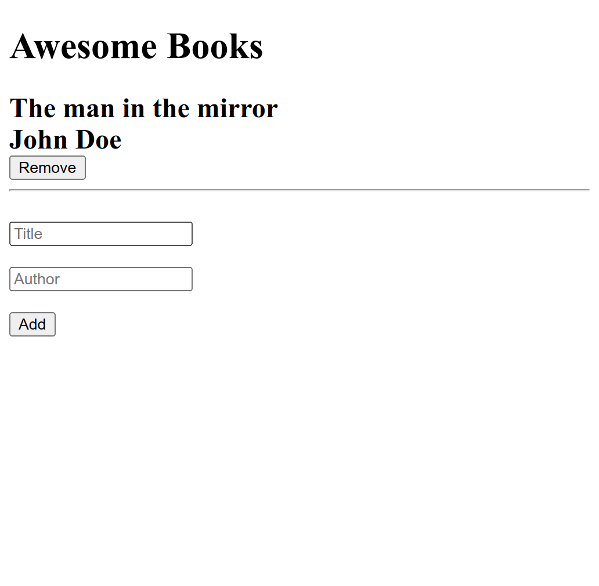

# Awesmoe Books

A Website demo for our project of book store, The website has ability of adding and removing you books from yor library, Thats reflects our coding skills.

  

## Live Link

[Awesome Books](https://zieeco.github.io/awesome-book/)

## Built With!

- HTML
- CSS
- JavaScript

## Getting Started

To get a local copy up and running follow these simple example steps.

### Prerequisites

clone repo: https://github.com/zieeco/awesome-book

👤 **Author1**

- GitHub: [@zieeco](https://github.com/zieeco)
- LinkedIn: [Isaac Imaobong Samuel](https://www.linkedin.com/in/isaac-imaobong-samuel-a4849b1b8/)

👤 **Author2**

- GitHub: [@Banstein](https://github.com/Banstein)
- Twitter: [@islam_bahnas](https://twitter.com/islam_bahnas)
- LinkedIn: [islam-bahnas](www.linkedin.com/in/islam-bahnas)

## 🤝 Contributing

Contributions, issues, and feature requests are welcome!

Feel free to check the [issues page](../../issues/).

## Show your support

Give a ⭐️ if you like this project!

## 📝 License

This project is [MIT](./MIT.md) licensed